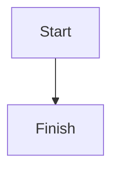

# Plan changes

For any non-trivial change, we want to lead with a planning phase which results in a written artifact and a hard stop for the user's express permission to continue. The urge to start coding right away as soon as you understand the task is exactly what this skill overrides.

This is a pre-change workflow. It is different from a post-change workflow. With this skill, we are producing a plan before touching/editing any code, not auditing/reviewing the diff after.

## Workflow

Run these steps in order. It is important that you do not edit code in Steps 1-6. The first code edit happens only after the user has allowed you to progress.

### Step 1: Reach a shared understanding

This is where you build a full end-to-end understanding and mental model of the following:

* Any reference documents/links/artifacts that the user has given you.
* The intent behind the change that the user is planning.
* If applicable: The relevant parts of the codebase(s) which may be part of this change. You are expected to start at the relevant entry points, then dive deeper to build a complete understanding of the following:

  * How is the current codebase architected/structured?
  * What are the codebase's conventions?
  * The existing codepath(s) which this change will start from, or interact with.
  * If applicable: The closest existing example present in the codebase to follow.
  * Any shared code, utils, or types which this change will interact with / touch / or change.

To achieve this step's outcome, it is expected that you clarify your understanding by interviewing the user until you reach a shared understanding. Map this as a design tree: Every decision branches into the decisions that hang off it.

The tree needs to be worked in rounds. The frontier is every decision whose prerequisites are already aligned on: the questions you can ask now without guessing the answers you have not heard yet. Ask the whole frontier in one round: number each question and give your recommended answer. Then wait for the user's answers before the next round.

Format a round like this:

```text
❓ **Q1** - **<question title>**: <question body, might be multiple paragraphs, including multiple choices>

➡️ <your recommended answer>

---

❓ **Q2** - **<question title>**: <question body, might be multiple paragraphs, including multiple choices>

➡️ <your recommended answer>
```

Each round the user answers reshapes the tree. Settled decisions push the frontier outward and unblock questions which depend on them. Recompute the frontier and ask the next round. A question whose answer depends on an unanswered question still open in this round belongs to a later round, not this one.

Finding facts is your job, never the user's. When a frontier question needs a fact, dispatch a sub-agent to find it. Do not ask the user anything which you could look up yourself. Do not block on your exploration: a running exploration is an unsettled prerequisite, so only the questions which are downstream of it need to wait for the sub-agent to report. You can ask the rest of the frontier now. The decisions are the user's. Put each of them to the user and wait for their answer.

**Completion Criteria**: The frontier is empty: every branch of the design tree has been visited, and nothing is left assumed. Do not progress until the user has confirmed that you have reached a shared understanding.

### Step 2: Find the smallest design

Before scoping, find the smallest design that satisfies the intent.

* State the change in one sentence: "Given ___, do ___."
* Separate what the requirement demands from what you are choosing to add. Every new table, service, layer, state, or abstraction needs a requirement behind it, not "it might be useful."
* Put the essential-vs-added split to the user directly. Useful probe: "if we deleted X and inlined it into Y, what would we lose?"
* If the design keeps growing while you explore, stop and question the requirement. Prefer the smallest change that could work.
* Prefer extending the pattern the codebase already uses. If a new concept does not fit an existing pattern, say why.
* If the design has drifted from the intent, for example new tables, services, or layers the requirement never asked for, say so and propose resetting to the smaller design rather than patching the drift.
* Name the files or concepts the change will add or reshape, and the purpose each one owns. Put that structure to the user and confirm it fits the existing architecture before drafting. If a new file does not fit an existing pattern (a domain, layer, or module), say so and justify it.

For the full architecture heuristics behind this (deletion test, fewest concepts, ownership, state), see the `review-changes` skill.

**Completion Criteria**: You can name the smallest design, and every concept beyond it is justified by a requirement rather than a preference.

### Step 3: Scope the change

Simply/clearly the specific scope in 1-2 sentences: What are the entry point(s)?, what are the methods which we will be creating/modifying?, or what is the specific set of features which this plan will cover?. Just saying that the scope is "the whole feature" is too broad, we need to narrow it to specifics.

**Completion Criteria**: The scope is a well defined and grounded. It is expected that the we can describe the scope as a 1-3 word "scope summary", and that summary would be specific and meaningful.

### Step 4: Align on the UI

Only for a change that touches a browser-visible surface. If that is unclear, ask the user.

Before drafting the plan, produce a visual proposal so the approved look and behavior can be recorded in it.

* Make it look like the real app. Reuse the project's design system and real components where they exist. Use mock data only, with no real side effects. Choose the medium that best shows the work, and say which style source you reused.
* Cover the state families that apply: data, interaction, form, content, system, and recovery. A missing state becomes part of the spec. Write the behavior as a short list. Add a Mermaid state diagram only when the flow branches.
* Present it with the `walkthrough-changes` skill, one screen or state at a time.
* Get explicit approval for the proposal on its own. Approving the mock is not approving the plan, and finishing the walkthrough is not approval either.
* Record the approved screenshot and the interaction spec in the plan's **Visual proposal** section.

The mock is throwaway. It never becomes the production implementation. Its job is alignment, then it becomes the reference the build is checked against.

**Completion Criteria**: For a browser-visible change, the visual proposal is approved and recorded, or the change is confirmed to have no browser-visible surface.

### Step 5: Draft the plan

Fill every section of the plan template below. Do not code. Save your plan as a single Markdown file in the repo/folder you are working in named `<SCOPE_SUMMARY>_PLAN.md`.

Your north star here is to create a proposal which is easy for a human to follow, with clear visual separation and hierarchy. Structure it with headings, distinct sections, and whitespace so it can be understood at a glance, even when it is long. Avoid dense, unstructured walls of text.

Write the plan in GitHub-flavored Markdown. Keep it easy to read on a phone and desktop, with short headings, scannable lists, narrow tables, and diagrams that fit a single column. Use the file tree and diagram guidance in **Plan presentation** below.

Each implementation step needs a check that says how we will know it is done. Fill the **Verification setup** section and give every step in the **Implementation order** a **Check** block. Call the Skill tool with `verification-contract` for the format and rules. If a check cannot be run, name the gap for the user to resolve rather than inventing a pass condition.

**Completion Criteria**: The draft plan is saved as expected, and every implementation step has a filled Check block or is explicitly flagged as a verification gap.

### Step 6: Wait on user review/approval

After saving the plan, ask whether the user wants a walkthrough before reviewing it. If they say yes, call the Skill tool with `walkthrough-changes` and follow it instead of dumping the whole plan into the conversation. When the walkthrough ends, show the plan path and return here to wait for approval. If they say no, present the plan and wait as usual. This is optional, so ask rather than assuming.

A walkthrough is not approval. Finishing the walkthrough does not start implementation. Only an explicit approval moves to `execute-changes`.

**Completion Criteria**: The user has been walked through the plan or given the chance to skip it, and an explicit user approval ("start implementing", "go for it", etc.) is received before any code can be edited. You are forbidden from making any modifications to code before you receive user approval.

## Plan template (in-body reference)

Note that it is expected that you populate/fill in each section. This is the aligned-on shape, and it's expected that it is kept consistent run to run.

* **Background**: A brief overview of the changes, and intent behind those changes, as you understand them.
* **Smallest design**: The change in one sentence, then what the requirement demands versus what you are choosing to add. Make the essential-versus-added split explicit so scope cannot quietly grow.
* **Context / How does the current approach work today**: This section acts as an easy-to-digest summary which establishes the baseline, from which your proposed changes will be framed against.
* **Proposed approach**: The changes you are proposing, framed against how the current approach works today. Use the diagrams and visuals in **Plan presentation** below. For anything with a public contract (an API, a client, a domain method), show the input and output shapes as short pseudocode, and use typed interfaces for the core logic.
* **Visual proposal**: For a browser-visible change, the approved mock and interaction spec from Step 4. Link the screenshot and list the states and behavior.
* **Files and methods to change**: Show the change as a directory tree with inline descriptions, not a flat table or list. Group files under their real directories so the structure is obvious. Mark each entry as added, modified, or removed, and give each file a short inline description of its purpose and what it contains. See **Plan presentation** below.
* **Verification setup**: How to start the system, tell when it is ready, use the feature, save the results, and stop what was started. Use the repo's docs (AGENTS.md, Makefile, README), not guesses. Write `n/a: <reason>` for a field that does not apply.
* **Implementation order**: A set of sequenced implementation steps, each with a **Check** block (Expected, Command, Setup, Failure). The goal of a given step is to ensure that the associated changes are easy to review and read.
* **Verification**: The check that shows each step is done. Tests are one kind of check, not the only kind. The format and rules live in the `verification-contract` skill. Changes that affect running services or stored data need a live check. Name any gaps rather than inventing a pass condition.
* **Non-goals / out of scope**: What this plan deliberately excludes, so the boundaries are explicit.
* **Operations / rollout**: For changes to a deployed system, the env vars, secrets, service settings, and deploy order required. Include anything that has to be configured outside the code.
* **Open Questions**: Anything that will need the user's input in order to progress.

## Plan presentation

Use the following layout and visuals to make the plan easy to scan and understand.

### Files and methods tree

The "Files and methods to change" section uses a directory tree with inline descriptions, for example:

```text
src/
├── domains/
│   └── company-generation/          [new]
│       ├── index.ts                 barrel export
│       └── company-generation.ts    CompanyGenerationDomain. One source at a time:
│                                    load baseline, update and add per source, resolve
│                                    logos via the image service, write the diffs.
├── api/
│   └── image-service/               [new]
│       ├── entrypoint.ts            Hono app on :3003. Parses requests, calls the service.
│       └── company-image-service.ts Owns all sharp work: resolve, materialize, differ.
└── jobs/
    └── generate-company-toml.ts     [modified] now a thin adapter over the domain.
```

### Diagrams and visuals

Plans should communicate with more than prose. Pick whichever of these reads best for the content:

* A fenced code block with a short ASCII flow for a pipeline or a before/after sequence.
* A fenced code block with a directory tree for structure, or a nested list for dependencies.
* A Markdown table for before/after comparisons.
* A Mermaid diagram in a `mermaid` fence when a real graph reads better than text.
* Typed interfaces and short pseudocode in fenced code blocks for the core logic.

For Mermaid diagrams, use a fenced `mermaid` block:

````markdown

````

Prefer top-to-bottom diagrams over wide ones. Keep tables short and code blocks narrow so they are easy to read on a phone as well as a larger screen.

## Things to keep in mind

* **Resume from an existing plan**: For a change on an already-planned feature, read the existing plan/progress first rather than re-driving from scratch.
* **Persist the plan when asked, or to save your work**: Save your plan to the repo/folder you are working in so a later session can read it back and resume.
* **Reset rather than defend**: If an in-progress design has grown beyond the intent, be willing to discard it and re-plan the smaller shape. Do not patch drift to protect sunk work.
* **Revise the plan when scope shifts**: If the design or scope changes materially after approval (new components, persistence, or services), update the plan file and re-confirm with the user before continuing. Do not silently expand an approved plan.
* **Writing style**: This should not be thought of as a formal report, but instead as a mechanism to clearly and simply articulate the plan before getting sign-off from the user. Do not include em dashes (-), semicolons, or other overly formal punctuation. Your writing style and tone should reflect the way a person would normally speak.
* **Easy to digest**: A plan can be long, but it should never feel dense. Give it clear visual separation and hierarchy so a human can follow it at a glance: headings, distinct sections, whitespace, and a consistent structure. What to avoid is the unbroken block of text with no structure.
* **Set the verification here**: The executor should run the checks in the approved plan, not decide later what counts as done. Use the `verification-contract` skill for the format and rules.
* **Context Preservation**: For any non-trivial research, exploration, data-gathering, web search, or code deep-dive task it is expected that you delegate to targeted subagents to ensure that your context is preserved.
